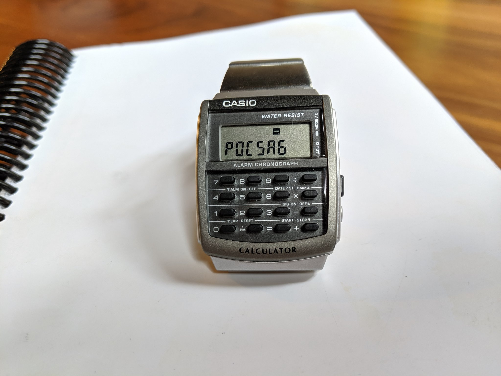

Howdy y'all,

This is a side project of mine to build a replacement circuit board
for the Casio 3208 module, used in the Casio CA-53W and CA-506
calculator watches.  It is not compatible with the 3228 module used in
the Databank watches, which have four external buttons instead of two.
As a side project, it has no warranty whatsoever and you shouldn't use
it for anything.

In the rare case that you find this project to be useful, you owe me a
pint of good, hoppy pale ale.  All license to use this project is
revoked if you try to pass off a pilsner instead.

In addition to the source code, there is handy documentation in the
[wiki](https://github.com/travisgoodspeed/goodwatch/wiki) and a
general interest website at [goodwatch.org](http://goodwatch.org/).
The wiki's
[DeveloperGuide](https://github.com/travisgoodspeed/goodwatch/wiki/DeveloperGuide)
page might be particularly handy.

73 from Knoxville,

--Travis

## Software Status

Our firmware is freely available in this repository, compiling with
the standard MSP430 compiler packages that ship with Debian.  It
consists of a
[Clock](https://github.com/travisgoodspeed/goodwatch/wiki/ClockApplet),
a Stopwatch, an RPN Calculator, and a [Hex Memory
Viewer](https://github.com/travisgoodspeed/goodwatch/wiki/HexApplet)
with Disassembler, all written in C.  It compiles in Debian with all
of the MSP430 packages installed.

On watches with a radio, we have
[Morse](https://github.com/travisgoodspeed/goodwatch/wiki/MorseApplet)
and GFSK transmitters, as well as an [OOK
transmitter](https://github.com/travisgoodspeed/goodwatch/wiki/OOK_Example)
that will command cheap remote-controlled relays.  It has a [frequency
counter](https://github.com/travisgoodspeed/goodwatch/wiki/CounterApplet).
The radio is accessible from a host computer over the UART for
building base stations and repeaters, or for rapidly prototyping radio
applications in Python.  P25 and DMR support might come soon.

Additionally, we've written our own client for the CC430's BootStrap
Loader (BSL).  You might find it handy for other projects involving
that chip, or other MSP430F5 and MSP430F6 chips without USB.  You will
need to be a member of the `dialout` group to flash the firmware.

## Hardware Status

Our replacement board is based around the CC430F6147, which combines
an MSP430 microcontroller with an LCD controller and a sub-GHz radio.
Thanks to pin compatibility, our fancy linker scripts produce a
firmware image that works just as well on the older CC430F6137
chip.

The
[GoodWatch30](https://github.com/travisgoodspeed/goodwatch/wiki/GoodWatch30)
is our current hardware revision, with filters that run from 300 MHz
to either 500MHz or 915MHz.  The GoodWatch20 family had narrower
filters at 433MHz, but is still supported.

See `BOM.txt` in the hardware directories for a parts list, and the
wiki for an assembly guide.

## Related Projects

[Pluto](https://github.com/carrotIndustries/pluto) is a replacement
PCB for the Casio F-91W that is also based on an MSP430.  We happily
use that project's [energy
monitor](https://github.com/carrotIndustries/energytrace-util)
utility for measuring our power budget.

[Elektronika-1](https://github.com/BenjaminSoelberg/elektronika-1) is
Benjamin Sølberg's replacement board for the Soviet Электроника-1
watch, based on an MSP430FR2433.

[Sensor Watch](https://github.com/joeycastillo/Sensor-Watch/) is Joey
Castillo's ATSAML22 replacement board for the Casio F-91W.  He adds a
backlight, and a 9-pin flex PCB allows you to add a custom sensor to
the watch, rather than have one built into the board.

The [CharlieWatch](https://github.com/osresearch/charliewatch) from
Trammell Hudson is a nice little fork of the GoodWatch that uses a
charlieplexed array of LEDs instead of a Casio watchcase.

[iceSIO](https://github.com/icelord75/icesio) matches the same Casio
3208 casings as the GoodWatch, but uses a PIC16 platform with
accelerometer, compass and environmental sensors.

[FaradayRF](https://faradayrf.com/) is a CC430 radio board intended
for amateur use, with a 500mW amplifier and GPS receiver.  Their radio
chain is far more carefully designed than ours, but in time, we hope
that the two projects will communicate with each other.

[openchronos-ng-elf](https://github.com/BenjaminSoelberg/openchronos-ng-elf)
seems to be the most recently maintained firmware for TI's OpenChronos
devkit, which uses the CC430F6137.  See Adam Laurie's
[ChronIC](http://adamsblog.rfidiot.org/2013/03/you-can-ring-my-bell-adventures-in-sub.html)
project for an early example of sniffing OOK traffic and replaying it
from a watch.

[F91 Kepler](https://gitlab.com/_Pegor/kepler_fw) is an OLED and BTLE
replacement for the Casio F91W module.  It uses a CC2640 and has some
rather good documentation.

